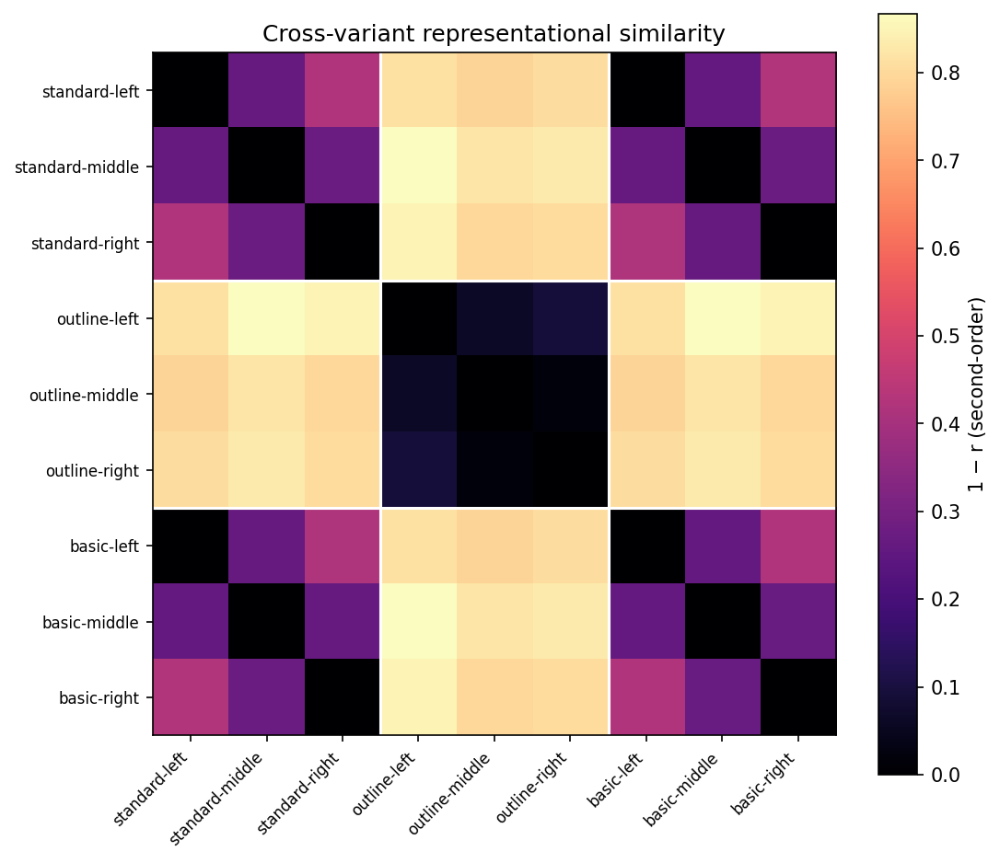
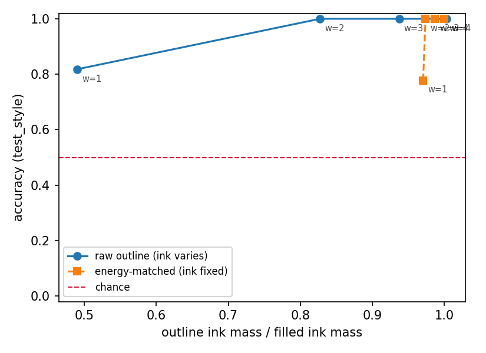

# illusion-rnn

A [neurogym](https://github.com/neurogym/neurogym)-based testbed for studying
**Transformational Apparent Motion (TAM)** in neural networks: task
environments, matched real-motion controls, a hand-made stimulus set, and
reference recurrent models — packaged so you can plug in your own model.


## What is TAM?

In transformational apparent motion, two *static* frames — two shapes, then
the same shapes joined by a bar — are perceived as a single object smoothly
transforming and moving in a definite direction. The percept requires solving
a shape-correspondence problem: which contours of frame 2 "came from" frame 1.
That makes TAM a compact probe of how visual systems infer motion from form.

This testbed frames TAM as a supervised trial task: networks are trained to
report motion direction (left / middle / right — or middle / up / down in the
vertical variant) either on TAM stimuli directly or on unambiguous frame-by-frame
motion controls, and are then tested on stimulus variants they never saw
(outline-only shapes, simplified layouts). The question: does motion inferred
from form transfer?

## Install

Requires Python ≥ 3.10. Checkpoints and the shapes dataset use git LFS.

```bash
git lfs install
git clone git@github.com:sh4r11f/illusion-rnn.git
cd illusion-rnn
uv sync            # or: pip install -e .
```

Library-only install (envs + models, no checkpoints):

```bash
pip install git+https://github.com/sh4r11f/illusion-rnn.git
```

## Quickstart

The snippet below assumes a full repo clone with git LFS (for the shipped
checkpoints); library-only installs (`pip install git+...`) can still build
environments and train models, but must download checkpoints separately.

```python
import illusion_rnn as ir

# a TAM environment (stimuli ship inside the package)
env = ir.make_env("tam", box_shape="square", variant="standard",
                  stim_ori="horizontal", img_size=64)
env.seed(0)
ir.plot_trials(env, n_trials=2)

# evaluate the shipped reference RNN on it
model = ir.load_rnn("checkpoints/rnn-pixel_h2048_tam-horiz.pt")
print(ir.evaluate(model, env, n_trials=100).accuracy)

# train your own
dataset = ir.make_dataset(env, batch_size=16, seq_len=100)
rnn = ir.RNNNet(input_size=64 * 64, hidden_size=256, output_size=6, dt=50)
history = ir.train(rnn, dataset, n_epochs=200)
```

See `notebooks/01_quickstart.ipynb` (tour + generalization result) and
`notebooks/02_train.ipynb` (training from scratch).

## The generalization result

The reference RNN — trained only on the *standard* TAM set — reaches 0.967
mean accuracy in-distribution (on `standard`, i.e. the training condition
itself), then drops to 0.100 mean accuracy on the genuinely held-out
`outline` variant (unseen at training time). That drop is not a story of
confidently wrong answers: the model abstains (reports "fixation" instead of
committing to a direction) on 77.7% of outline trials, and even restricted to
the trials where it does commit, accuracy is only 0.448 — better than the
0.33 chance rate, but far below in-distribution performance. In short, on
outline stimuli it mostly refuses to answer rather than answering wrong.


Exact numbers and every shipped model: [`checkpoints/MANIFEST.md`](checkpoints/MANIFEST.md).

Note: `TAM_basic`, a third stimulus directory shipped alongside `standard`
and `outline`, is **not** a held-out variant — all 24 of its images are
byte-identical to `TAM_task` images (21 share filenames, 3 are internal
duplicates; see `tests/test_stimuli_integrity.py`). Evaluating on it measures
performance on training data, not transfer, so it has been removed from the
comparison above.

## Analyses

`scripts/run_analyses.py` reproduces the project's dynamics and RSA analyses
(corrected reimplementations of the 2022–23 exploratory notebooks — see the
deviations documented in `illusion_rnn/analysis.py`): PCA of hidden-state
trajectories in the trained state space, time-binned PCA with top-loading
units, condition-averaged unit timecourses, unit-by-unit RDMs, and
second-order RSA within and across stimulus variants.

```bash
uv run python scripts/run_analyses.py   # writes results/*.npz (committed)
```

`notebooks/03_dynamics.ipynb` and `notebooks/04_rsa.ipynb` visualize the
committed artifacts. The cross-variant RSA asks the headline question —
is outline TAM represented like standard TAM? —



## The correspondence task

The 2023 result above cannot distinguish two very different hypotheses. In the
original stimulus set frame 1 is a single fixed image per shape, so the
direction label is fully determined by frame 2 alone — meaning "the network
infers motion from shape correspondence across time" and "the network
classifies one static image" predict the same 0.967. Nothing in that
experiment tells them apart.

`TAMCorrespondenceTask` (`illusion_rnn/envs.py`) is the corrected experiment.
Stimuli are generated programmatically (`illusion_rnn/generate.py`) rather than
drawn from ~22 hand-made JPGs, and the **bar's geometry is sampled before and
independently of the direction label**, so frame 2 is bit-identical whichever
direction the trial is. A model that sees only frame 2 is therefore at chance
*by construction*, not by hope.

Two stimulus families ship, and the contrast between them is the point:

- **`balanced`** — the corrected task described above.
- **`classic`** — the original 2023 geometry reproduced at scale, where frame 2
  *is* label-readable. It exists to quantify the defect, not to train on.

### Result

5 seeds × 6 architectures × 2 families, 64px, `hidden=256`
(`results/sweep.json`, mean accuracy on the training distribution with 95% CI):

| architecture | `balanced` (corrected) | `classic` (2023 geometry) |
|---|---|---|
| `RNNNet` | 1.000 [1.000, 1.000] | 1.000 [1.000, 1.000] |
| `GRUNet` | 1.000 [1.000, 1.000] | 1.000 [1.000, 1.000] |
| `FFStack` | 1.000 [1.000, 1.000] | 1.000 [1.000, 1.000] |
| `FF1Only` (frame 1 only) | 0.818 [0.805, 0.832] | 0.516 [0.489, 0.543] |
| **`FF2Only` (frame 2 only)** | **0.503 [0.472, 0.534]** | **1.000 [1.000, 1.000]** |

That bottom row is the whole argument. On the corrected stimuli a frame-2-only
model sits exactly at chance while binding models are perfect; on a faithful
reproduction of the 2023 geometry, frame 2 alone is *sufficient*. The original
0.967 is consistent with a network doing no temporal integration at all.

The `FF1Only` floor of 0.818 is **an artifact of our own position split**, not a
property of the task: the `train` split restricts bars to the lower 60% of the
track, and narrowing that band makes shape position more diagnostic of
direction. Bayes-optimal frame-1-only accuracy is 0.697 on the full track, 0.818
on `train`, and 0.942 on `test_position`. FF1Only is simply sitting at the
optimum for the band it trains on, so 0.82 — not 0.50 — is the bar a binding
model has to clear here.

### Two negative results

**Nothing generalizes across position.** On `test_position` (bars in the held-out
upper 40% of the track) *every* architecture collapses to chance — `RNNNet`
0.523, `GRUNet` 0.562, `FFStack` 0.407 — with zero abstention, so these are
committed wrong answers, not refusals. These are fully-connected models on
flattened pixels with no translation invariance, so this is expected, but it
means the models that score 1.000 are solving the task in a **position-locked**
way rather than learning an abstract correspondence rule. Held-out *shapes*
transfer fine (`RNNNet` 1.000 on `test_shape`); held-out *positions* do not.

**The frame-order control only works when each frame is shown once.** Shuffling
frame order should destroy the answer under `transform="growth+shrink"`, where
the same frame pair appears in both orders with opposite labels. It doesn't —
at the default `n_repeats=4`, `RNNNet-shuffled` still scores 0.999:

| | `RNNNet` | `RNNNet-shuffled` |
|---|---|---|
| `n_repeats=4` (default) | 1.000 | **0.999** — control is vacuous |
| `n_repeats=1` | 1.000 | **0.524** — control works |

The reason is repetition, not order: with frame 2 shown 4× and frame 1 once, the
shuffled multiset is `{f1, f2, f2, f2, f2}`, and a model recovers which frame
was which by **counting** rather than by position. Order is only genuinely
destroyed when each frame appears exactly once. Anyone building a
shuffle-based order control on a repeated-frame stimulus should check this.
(`results/sweep_order.json`, `results/sweep_order_n1.json`.)

### Outline transfer is a form effect, not an input-drive effect

The 2023 checkpoint scored 0.100 on outline stimuli, but a single number can't
say whether the network *can't infer motion from outline form* or whether the
outline input is simply too faint to drive it at all. Evaluating one
filled-trained `RNNNet` across stroke widths, under both raw and
ink-energy-matched rendering, separates them:



| stroke width | raw ink ratio → acc | energy-matched ink ratio → acc |
|---|---|---|
| 1 | 0.490 → **0.818** | 0.970 → **0.778** |
| 2 | 0.827 → 1.000 | 0.974 → 1.000 |
| 3 | 0.937 → 1.000 | 0.987 → 1.000 |
| 4 | 1.003 → 1.000 | 1.000 → 1.000 |

At width 1, restoring the missing ink (0.490 → 0.970) does **not** restore
accuracy (0.818 → 0.778). The thin-stroke deficit is therefore about outline
*form*, not about input drive — energy-matching doesn't rescue it. At widths ≥ 2
the filled-trained model transfers to outline at ceiling, so on this corrected
task outline transfer largely succeeds, in contrast to the 2023 checkpoint's
near-total outline failure.

### Reproducing

```bash
uv run python scripts/verify_generator.py    # checkpoint 1: frame-2 label independence
uv run python scripts/verify_baselines.py    # checkpoint 2: baselines land at their ceilings
uv run python scripts/run_sweep.py --quick   # a fast local grid
uv run python scripts/run_order_control.py                 # order control (n_repeats=4)
uv run python scripts/run_order_control.py --n-repeats 1   # ... and the condition where it works
```

Full results, the three unplanned findings, and notes on what this does and
does not show: [`docs/findings/2026-08-25-correspondence-results.md`](docs/findings/2026-08-25-correspondence-results.md).

The full grid was run on Hugging Face Jobs (`scripts/hf_sweep.py`, ~1h on one
L4). `uv run pytest -m slow` runs the two training-based gate tests, which are
excluded from the default suite.

## Plug in your own model

`ir.train` / `ir.evaluate` accept any callable module with the contract
`model(x: (T, B, F)) -> (out: (T, B, n_actions), activity: (T, B, H))`.
Two input regimes:

- **Raw pixels** (default): frames are flattened to `F = img_size²`.
- **Feature encoder**: pass `encoder=ir.cnn_encoder(your_cnn)` where the CNN
  maps `(N, 1, H, W) -> (logits, features)`; the RNN then sees `F =
  feature_dim`. The shipped `rnn-cnnfeat64_*` checkpoints use the packaged
  `ShapesCNN` this way (100×100 inputs — see the manifest).

Custom stimuli: give the loaders a directory of your own JPGs
(`ir.load_tam(64, source="path/to/frames")`) following the filename
conventions in `illusion_rnn/stimuli.py`, and pass the result to the env via
`stimuli=`.

## Layout

```
illusion_rnn/       the package: envs, stimulus loaders, models, train/eval, plotting
  generate.py       programmatic stimulus generator + train/test splits
  sweep.py          multi-seed architecture grid runner
checkpoints/        trained models (git LFS) + MANIFEST.md
notebooks/          01_quickstart, 02_train, 03_dynamics, 04_rsa; legacy/ holds
                    the 2022-23 research record
scripts/            verification checkpoints, sweeps, figures, CNN retraining
results/            committed analysis + sweep artifacts (*.npz, *.json)
data/shape_dataset/ training data for that CNN (git LFS, 90 MB)
tests/              pytest suite (checkpoint tests skip without LFS content;
                    training-based gates are marked `slow` and excluded by default)
```

## Limitations

**The 2023 hand-made set** is small (a few exemplars per shape × condition) and
its train and eval draw from the same ~22 images, so its 0.967 is a
training-set number. Read it as a proof-of-concept, not a benchmark. `TAM_basic`
is not a held-out variant — every one of its images is a byte-identical copy of
a training image — and is excluded from the transfer comparison for that reason.

**The correspondence task** fixes the frame-2 leak but has its own bounds. No
architecture generalizes to held-out bar positions (see above), so the models
are position-locked rather than learning an abstract correspondence rule. The
frame-1-only floor of 0.82 is inflated by our own position split, not intrinsic
to the task. The frame-order control is only meaningful at `n_repeats=1`. And
on a bounded canvas both static baselines cannot be driven to chance
simultaneously — the design makes frame-2 provably 50% and measures the frame-1
residual rather than assuming it away (see
`docs/superpowers/specs/2026-08-15-correspondence-testbed-design.md` §3).

**Not yet done:** no human psychophysics anchor. Nothing here shows the networks
resemble human TAM perception; the claims are about what the networks compute,
not about whether they see the illusion.

Trials follow one fixed timing template (fixation → frames → decision at
dt = 50 ms), configurable via the `timing` argument.

## Attributions

- Task framework: [neurogym](https://github.com/neurogym/neurogym)
  (Molano-Mazón et al., 2022).
- Shape-classification data for the CNN encoder: 2D geometric shapes dataset,
  El Korchi & Ghanou (2020), <https://doi.org/10.17632/wzr2yv7r53.1>.
- `scripts/train_shape_cnn.py` derives from a classroom implementation
  adapted for this project in 2022.
- The 2022–2023 research notebooks this grew from are preserved in
  `notebooks/legacy/`.

## License

MIT — see [LICENSE](LICENSE).
