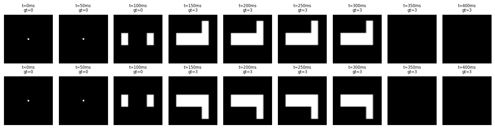
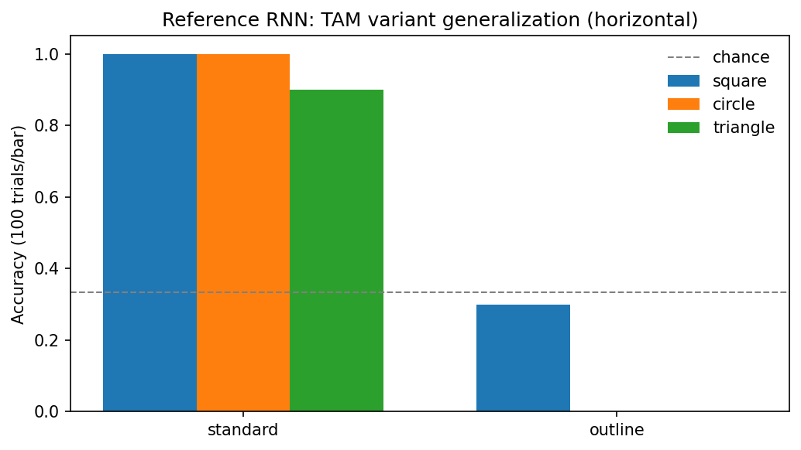

# illusion-rnn

A [neurogym](https://github.com/neurogym/neurogym)-based testbed for studying
**Transformational Apparent Motion (TAM)** in neural networks: task
environments, matched real-motion controls, a hand-made stimulus set, and
reference recurrent models — packaged so you can plug in your own model.



## What is TAM?

In transformational apparent motion, two *static* frames — two shapes, then
the same shapes joined by a bar — are perceived as a single object smoothly
transforming and moving in a definite direction. The percept requires solving
a shape-correspondence problem: which contours of frame 2 "came from" frame 1.
That makes TAM a compact probe of how visual systems infer motion from form.

This testbed frames TAM as a supervised trial task: networks are trained to
report motion direction (left / middle / right, or up / down in the vertical
variant) either on TAM stimuli directly or on unambiguous frame-by-frame
motion controls, and are then tested on stimulus variants they never saw
(outline-only shapes, simplified layouts). The question: does motion inferred
from form transfer?

## Install

Requires Python ≥ 3.10. Checkpoints and the shapes dataset use git LFS.

```bash
git lfs install
git clone git@github.com:sh4r11f/illusion-rnn.git
cd illusion-rnn
uv sync            # or: pip install -e .
```

Library-only install (envs + models, no checkpoints):

```bash
pip install git+https://github.com/sh4r11f/illusion-rnn.git
```

## Quickstart

```python
import illusion_rnn as ir

# a TAM environment (stimuli ship inside the package)
env = ir.make_env("tam", box_shape="square", variant="standard",
                  stim_ori="horizontal", img_size=64)
env.seed(0)
ir.plot_trials(env, n_trials=2)

# evaluate the shipped reference RNN on it
model = ir.load_rnn("checkpoints/rnn-pixel_h2048_tam-horiz.pt")
print(ir.evaluate(model, env, n_trials=100).accuracy)

# train your own
dataset = ir.make_dataset(env, batch_size=16, seq_len=100)
rnn = ir.RNNNet(input_size=64 * 64, hidden_size=256, output_size=6, dt=50)
history = ir.train(rnn, dataset, n_epochs=200)
```

See `notebooks/01_quickstart.ipynb` (tour + generalization result) and
`notebooks/02_train.ipynb` (training from scratch).

## The generalization result

The reference RNN — trained only on the *standard* TAM set — transfers (or
fails to, per variant) as follows:



Exact numbers and every shipped model: [`checkpoints/MANIFEST.md`](checkpoints/MANIFEST.md).

## Plug in your own model

`ir.train` / `ir.evaluate` accept any callable module with the contract
`model(x: (T, B, F)) -> (out: (T, B, n_actions), activity: (T, B, H))`.
Two input regimes:

- **Raw pixels** (default): frames are flattened to `F = img_size²`.
- **Feature encoder**: pass `encoder=ir.cnn_encoder(your_cnn)` where the CNN
  maps `(N, 1, H, W) -> (logits, features)`; the RNN then sees `F =
  feature_dim`. The shipped `rnn-cnnfeat64_*` checkpoints use the packaged
  `ShapesCNN` this way (100×100 inputs — see the manifest).

Custom stimuli: give the loaders a directory of your own JPGs
(`ir.load_tam(64, source="path/to/frames")`) following the filename
conventions in `illusion_rnn/stimuli.py`, and pass the result to the env via
`stimuli=`.

## Layout

```
illusion_rnn/       the package: envs, stimulus loaders, models, train/eval, plotting
checkpoints/        trained models (git LFS) + MANIFEST.md
notebooks/          01_quickstart, 02_train; legacy/ holds the 2022-23 research record
scripts/            optional: retrain the ShapesCNN feature extractor
data/shape_dataset/ training data for that CNN (git LFS, 90 MB)
tests/              pytest suite (checkpoint tests skip without LFS content)
```

## Limitations

The stimulus set is small and hand-made (a few exemplars per shape ×
condition); results should be read as a proof-of-concept testbed, not a
benchmark. Trials follow one fixed timing template (fixation → 5 frames →
decision at dt = 50 ms), configurable via the `timing` argument.

## Attributions

- Task framework: [neurogym](https://github.com/neurogym/neurogym)
  (Molano-Mazón et al., 2022).
- Shape-classification data for the CNN encoder: 2D geometric shapes dataset,
  El Korchi & Ghanou (2020), <https://doi.org/10.17632/wzr2yv7r53.1>.
- `scripts/train_shape_cnn.py` derives from a classroom implementation
  adapted for this project in 2022.
- The 2022–2023 research notebooks this grew from are preserved in
  `notebooks/legacy/`.

## License

MIT — see [LICENSE](LICENSE).
